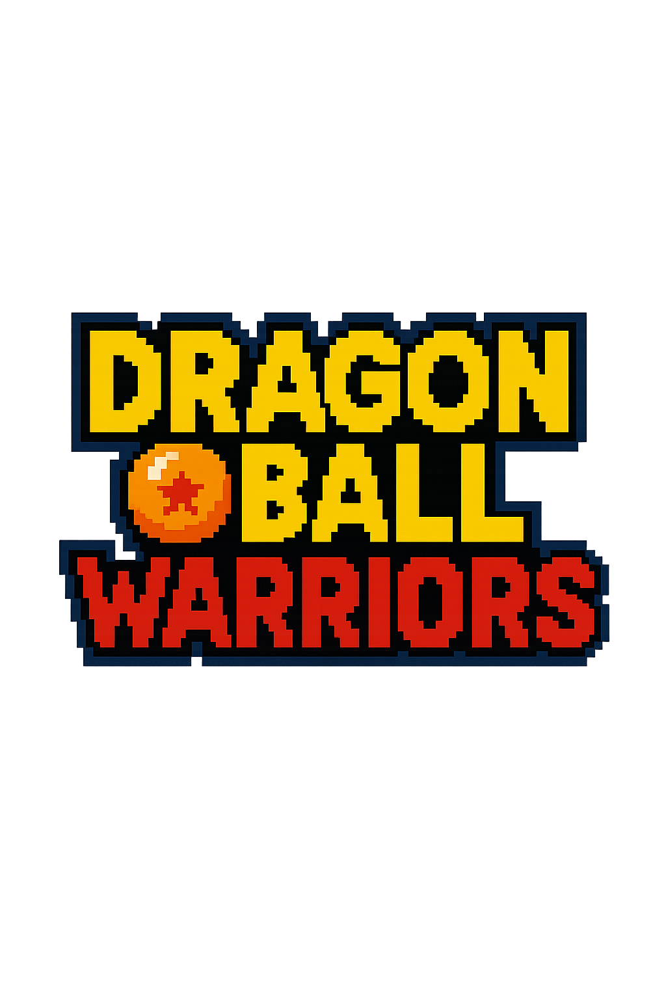
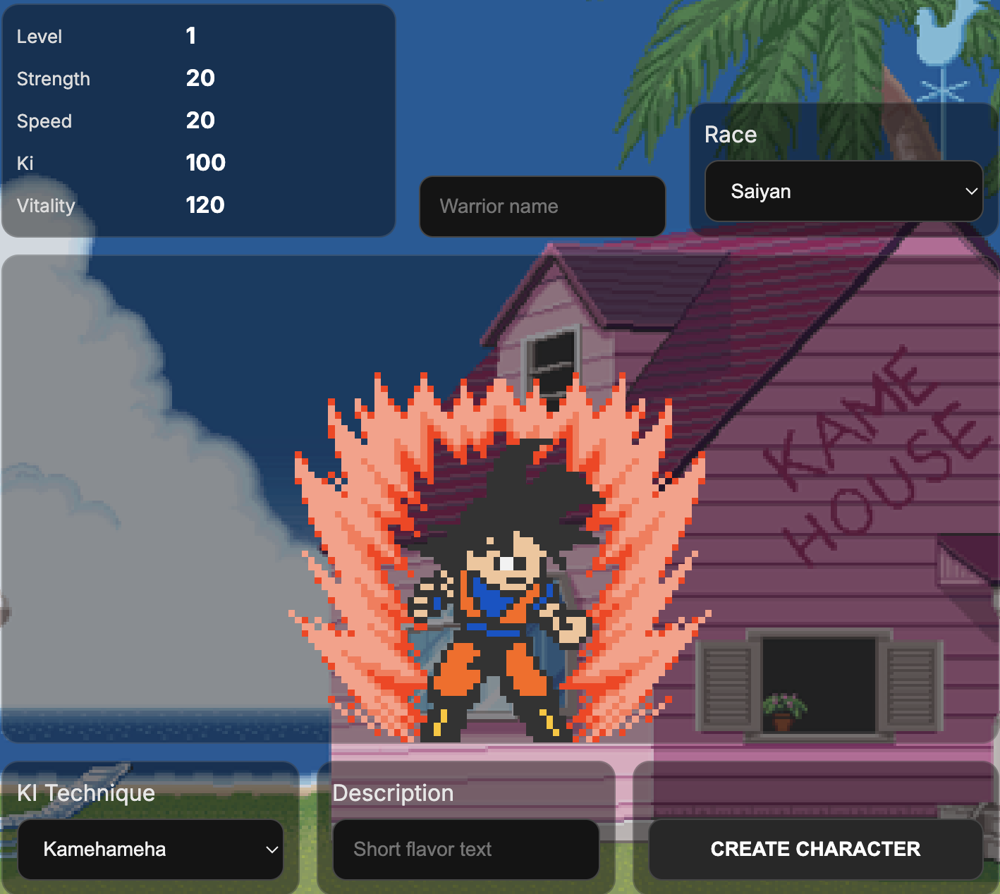
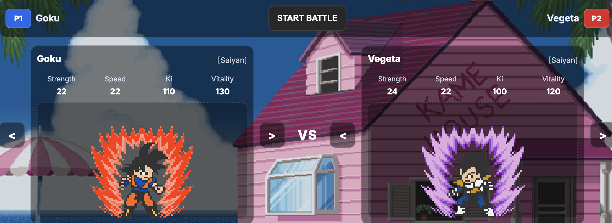
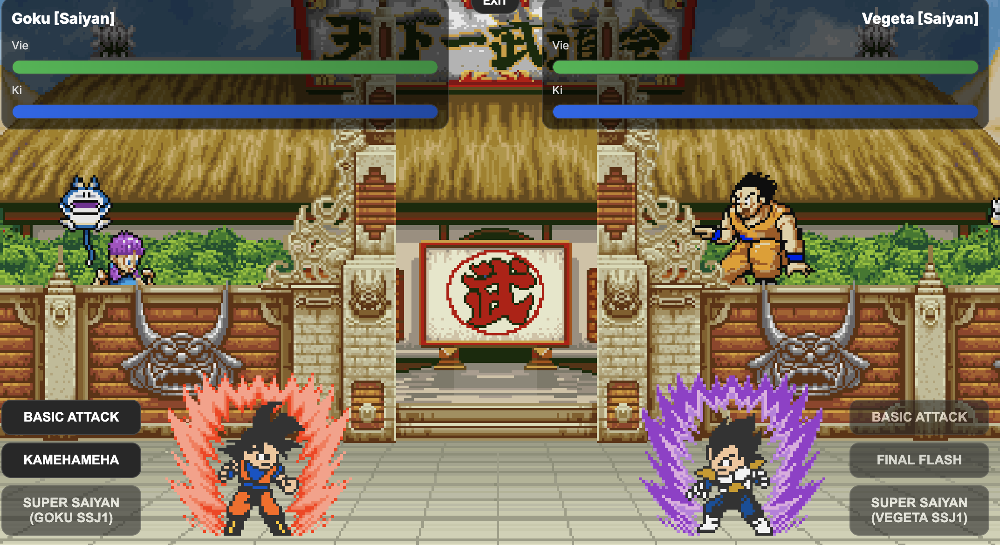

# Dragon Ball Warriors:
<p align="center">
  
</p>

Projet **fan‑made** en **TypeScript orienté objet (POO)**, sans framework.  
Particularité : architecture propre en **design patterns** (Singleton, Factory, Builder, State, Template Method, Proxy, Observer, Decorator, Command).

---

## 📚 Sommaire
1. [🚀 Lancer le jeu (2 manières)](#-lancer-le-jeu-2-manières)
2. [🧰 Prérequis & installation](#-prérequis--installation)
3. [🧠 Comment ça marche (POO + Patterns)](#-comment-ça-marche-poo--patterns)
4. [🔁 Flux type](#-flux-type)
5. [🧪 Recettes d’extensibilité](#-recettes-dextensibilité)
6. [📣 Catalogue d’événements](#-catalogue-dévévénements)
7. [🖼️ Captures d’écran / médias](#️-captures-décran--médias)
8. [❓ FAQ rapide](#-faq-rapide)
9. [⚖️ Licence & crédits](#️-licence--crédits)

---

## 🚀 Lancer le jeu (2 manières)

> **Important** : les deux modes utilisent **la même base de code**. Choisis ce qui te convient.

### 1) Dans le navigateur (dev)
```bash
npm install
npm run dev
```
- Ouvre l’URL locale affichée dans le terminal (ex: `http://localhost:****`).

### 2) En application de bureau (Electron)
```bash
npm install
npm run game
```
- Lance une fenêtre **Electron** avec le jeu.

> Si les scripts ne sont pas présents, ajoute-les dans ton `package.json` :
```jsonc
{
  "scripts": {
    "dev": "vite",         // lance le jeu dans le navigateur
    "game": "electron ."   // lance le jeu via Electron
  }
}
```

---

## 🧰 Prérequis & installation

- **Node.js** ≥ 18 recommandé (LTS)  
- **npm** (fourni avec Node)
- Cloner le repo puis :  
  ```bash
  npm install
  ```

---

## 🧠 Comment ça marche (POO + Patterns)

- **Singleton** — `GameManager`, `EventBus`, `AudioManager`  
  *Rôle* : un seul point de vérité pour le roster, les attaques, les événements et l’audio.  
  *Effet* : cohérence globale, abonnements simples côté UI.

- **Factory** — `WarriorFactory`  
  *Rôle* : créer un guerrier selon sa **race** (Saiyan, Namekian, Android) sans `if` partout.  
  *Effet* : ajouter une race = enregistrer une nouvelle classe dans la Factory.

- **Builder** — `WarriorBuilder` (CreateView)  
  *Rôle* : construire un **perso custom** en étapes (race → nom → choix KI) avec validations.  
  *Effet* : objets propres, prêts à être enregistrés dans le `GameManager`.

- **State** — `WarriorState` (`Normal`, `Injured`, `Exhausted`, `Dead`)  
  *Rôle* : comportement dépendant de l’état (dégâts sortants, coût en KI).  
  *Effet* : transitions d’état après pertes/soins, émission d’événements `StateChanged`.

- **Template Method** — `Attack` base + `NormalAttack`, `KiEnergyAttack`, `SpecialAttack`  
  *Rôle* : pipeline commun d’une attaque (coûts → esquive → dégâts → événements).  
  *Effet* : cohérence des attaques, variations simples par sous‑classes.

- **Proxy** — `SpecialAttackProxy`  
  *Rôle* : **gating** des Spéciales (KI mini, PV bas autorisés…) avant d’appeler la vraie `SpecialAttack`.  
  *Effet* : règles méta centralisées, feedback propre si refus.

- **Observer** — `EventBus` + `GameEvents`  
  *Rôle* : le domaine **publie**, l’UI/audio **s’abonnent** (barres de vie/ki, toasts, sons).

- **Decorator** — `Effects` : `SuperSaiyanEffect`, `RegenerationEffect`, `EnergyLeechEffect`  
  *Rôle* : capacités **temporaires** (bonus/malus) ajoutées sans toucher à la classe.  
  *Effet* : badges UI, hooks par **tick**, rollback garanti à la fin.

- **Command** — `domain/commands` (bus + handlers + contexte)  
  *Rôle* : encapsuler les **actions métier** (attaque, fin de tour, IA, tournoi).  
  *Effet* : exécution structurée + logs/historique.

- **Memento** - `battleMemento` (BattleMemento + BattleSnapshot)
  *Rôle* : sauvegarder/restaurer l’état d’un combat (HP/Ki P1/P2, effets actifs, tour, contexte) sans exposer les détails internes.
  *Utilisation* : snapshot créé au startBattle(), en campagne le bouton Retry restaure via battleMemento.applyTo(...).
  *Effet* : permet de réessayer un combat perdu sans casser la progression ; Originator = Warrior/TurnManager, Caretaker = BattleView (mémoire in-memory, extensible).

---

## 🔁 Flux type

### A) Pipeline d’une attaque (Template Method + Observer)
1. **Pré‑checks** (ex: Proxy Spéciale) → Event `AttackPreviewFailed` si refus.  
2. **Dépense** KI (ou annulation si impossible).  
3. **Jet d’esquive** (probabilités selon stats/états/effets).  
4. **Calcul dégâts** (modulateurs `State` + `Effects`).  
5. **Application PV** ; transitions d’**état** si seuils franchis.  
6. **Événements** : `AttackExecuted`, `DamageApplied`, `StateChanged`, `KO` éventuel.  
7. **Hooks d’effets** (ex: `EnergyLeech` sur tick).

### B) Cycle d’un tour (Command + Observer)
1. UI **dispatch** `StartTurnCommand`.  
2. Joueur choisit une **Action** (attaque, item/bean, transfo, défense) → commande dédiée.  
3. Bus → Handler → Domaine ; événements vers l’UI (`TurnChanged`, `EffectTicked`).  
4. UI rend les **feedbacks** (toasts, jauges, audio).  
5. **Fin de tour** → `EndTurnCommand` (vérifie effets à durée, Z‑index spécial, etc.).

---

## 🧪 Recettes d’extensibilité

### ➕ Ajouter une **race**
1. `class NewRaceWarrior extends Warrior` (invariants).  
2. `WarriorFactory.register("newrace", NewRaceWarrior)`.  
3. Mettre à jour `KI_CHOICES_BY_RACE` + presets si besoin.  
4. (Optionnel) effets/transfos spécifiques via Decorators.

### 💥 Ajouter une **attaque**
1. Étendre `Attack` (label, multiplicateur, conditions).  
2. Si règles méta : **Proxy** dédié.  
3. Enregistrer côté `GameManager` / tables d’attaques.

### ✨ Ajouter un **effet** (Decorator)
1. Implémenter `Effect` : `apply()`, `onTick()`, `cleanup()`.  
2. Déclarer badge + règles de cumul/priorité.  
3. Publier `EffectApplied/EffectTicked/EffectExpired`.

---

## 📣 Catalogue d’événements

- `BattleStarted`, `BattleEnded`  
- `TurnChanged`, `EndTurnRequested`  
- `AttackPreviewFailed`, `AttackExecuted`, `DamageApplied`, `DodgeSucceeded`  
- `HealthChanged`, `KiChanged`, `KO`  
- `StateChanged { from, to }`  
- `EffectApplied`, `EffectTicked`, `EffectExpired`  
- `TournamentSeeded`, `MatchLaunched`, `AIMoveComputed`

> Astuce UX : regrouper en **toasts** lisibles et limiter le spam (throttle).

---

## 🖼️ Captures d’écran / médias

<p align="center">
  
</p>
<p align="center">
  
  
</p>


## ❓ FAQ rapide

- **Rien ne s’affiche avec `npm run game` ?**  
  Vérifie que **Electron** est installé dans le projet (`devDependencies`) et que le point d’entrée existe (`main` côté Electron).

- **Port déjà utilisé en `dev` ?**  
  Ferme l’autre serveur ou lance `vite --port 5174` (ou mets un port libre).

- **Node trop ancien ?**  
  Installe Node LTS (≥ 18), supprime `node_modules/` et `package-lock.json`, puis `npm install`.

---

## ⚖️ Licence & crédits

Projet **fan‑made** à but **éducatif**. Non affilié à Toei Animation, Bird Studio, Shueisha, etc.  
Tous les noms/visuels originaux restent la propriété de leurs ayants droit.
